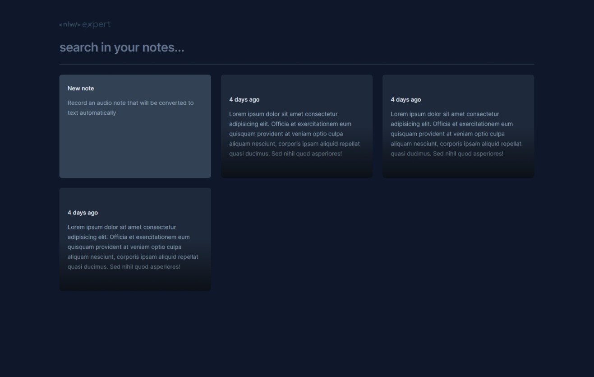

# Expert Notes

## Tech used:

- **Frontend**: [Vite](https://vitejs.dev/)
- **Lib**: [React](https://reactjs.org/) & [Typescript](https://www.typescriptlang.org/)
- **Styling**: [Tailwind CSS](https://tailwindcss.com/)
- **Deployment**: [Vercel](https://vercel.com)

## Screenshots



## Overview

This project was developed in the [Rocketseat](https://www.rocketseat.com.br/) NLW 14 Expert using vite and tailwind.
It's a basic note taking app.

## Running Locally

This application requires Node.js v20+.

```bash
$ git clone https://github.com/msdevpt/expert-notes.git
$ cd expert-notes
$ pnpm i
$ pnpm run dev
```

## Credits

- [Rocketseat](https://www.rocketseat.com.br/) 
- [Design](https://www.figma.com/community/file/1336456128647909148/nlw-expert-notes)